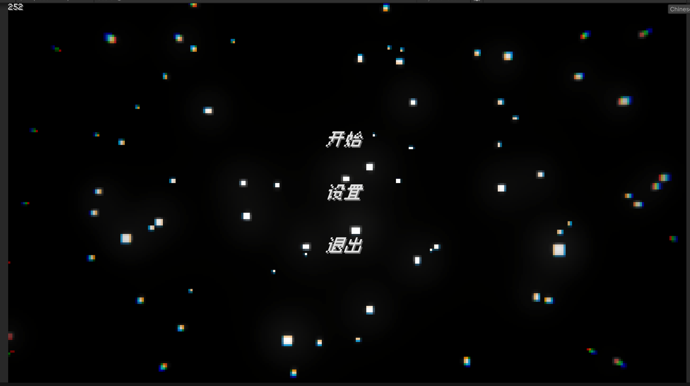
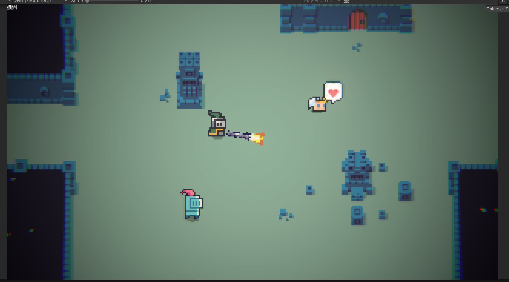
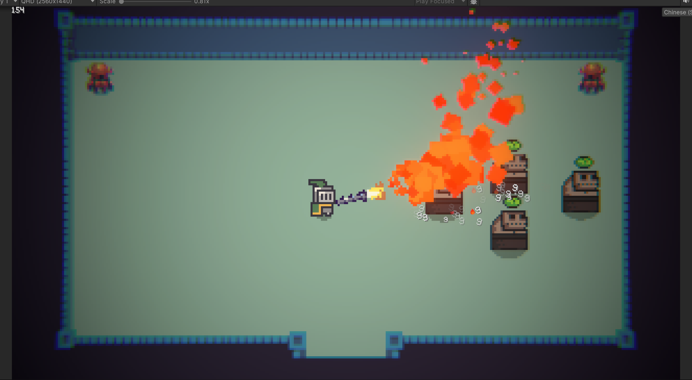
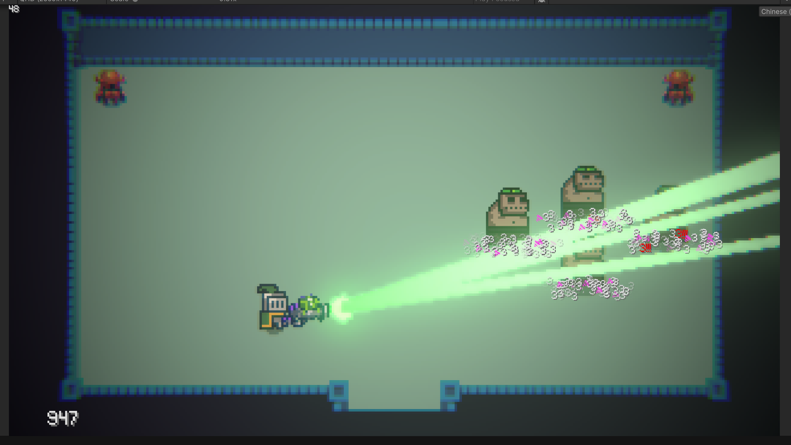
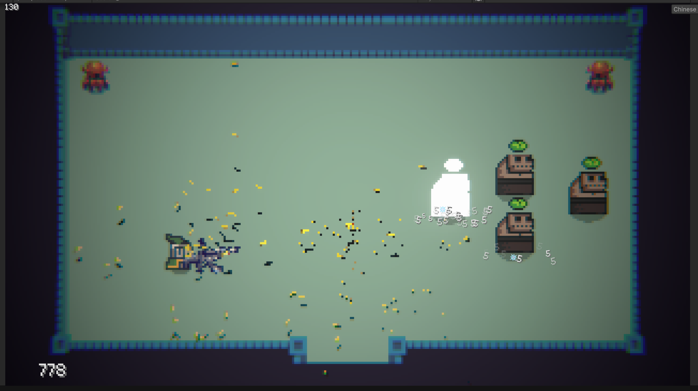

## DungeonDemo

---

### 导航

- [DungeonDemo](#dungeondemo)
  - [导航](#导航)
  - [简介](#简介)
  - [计划](#计划)
  - [游戏截图](#游戏截图)

### 简介

- 边学边做的一个肉鸽小游戏
- 有一些个人喜欢的视觉效果和小巧思

### 计划
- 多处~~缝合~~学习，包括以撒、warframe、元气骑士等游戏
- 游戏中包含多个大区域，每个大区域由种子随机生成的房间构成
- 包含的房间类型
    - 小怪房间  ->经验 道具 金币 
    - 精英怪房间 ->经验 道具 金币 晶石
    - boss房->经验 道具 金币 晶石 武器
    - 商人房 ->消耗金币 获取道具 晶石
    - 特殊房? 武器 晶石 特殊buff?
    - 入口房->进入区域时所在的房间
- 武器+晶石
    - 晶石能够改变武器的机制和数值
    - 晶石是通用的，但是武器不一定能够使用晶石的效果
- 武器的基础属性
    - 基础伤害
    - 暴击倍率
    - 触发几率
    - 伤害类型[可以有多种]
    - 暴击率
    - 攻击速度
    - 弹匣容量
    - 换弹速度
    - 精准度
    - 射击模式
    - 射弹数量
    - 射弹最远距离
    - 射弹飞行速度
    - 射弹大小
- 可被攻击的生物基础属性
    - 基础生命值
    - 护甲
    - 纯伤害减免
    - 元素伤害减免

`伤害系统相关计算公式可移步warframe维基，基本都是套用的它的（改了一些参数）`

- 角色？
    - 如果可以切换角色，什么时候可以切换，在哪里切换
    - 角色之间有什么区别
    - 不同的角色应该有个很重要的机制区别 技能？ 主动/被动
    - 欲望系统
        - 不同欲望值累计产生不同的机制和效果 

- 分支玩法（搁置
   - 召唤 局内
   - 道具 局内 局外

### 游戏截图

- 
- 
- 
- 
- 

---